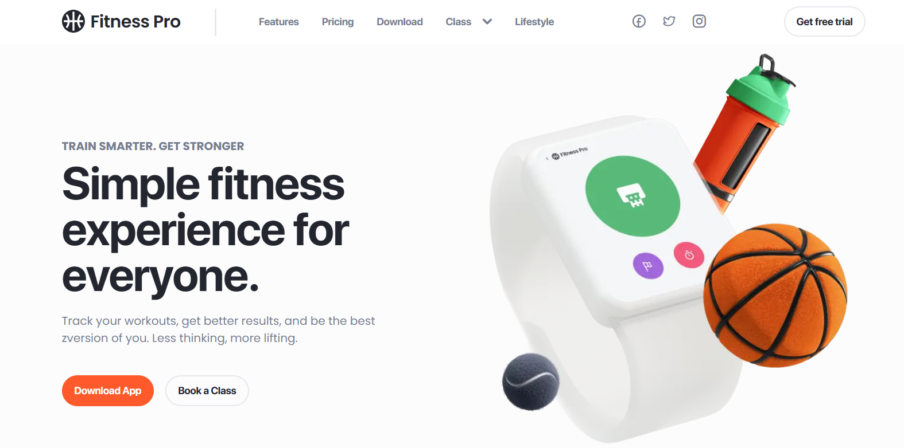

# 🏋️‍♂️ Fitness App Website

  

 # Adaptive layout of a multi-page fitness application layout.

 ## 🛠️ Technologies Used

- **HTML**: For building the structure and layout of the website.
- **CSS**: For styling and creating a visually appealing design.
- **JavaScript**: For dynamic functionality, such as user interactions and handling real-time data.

🔗 Live Demo:  [Your GitHub Pages Link] (https://alexsand-r.github.io/fitness-2/home.html)
📫 Contact Me:
1inboxna@gmail.com
